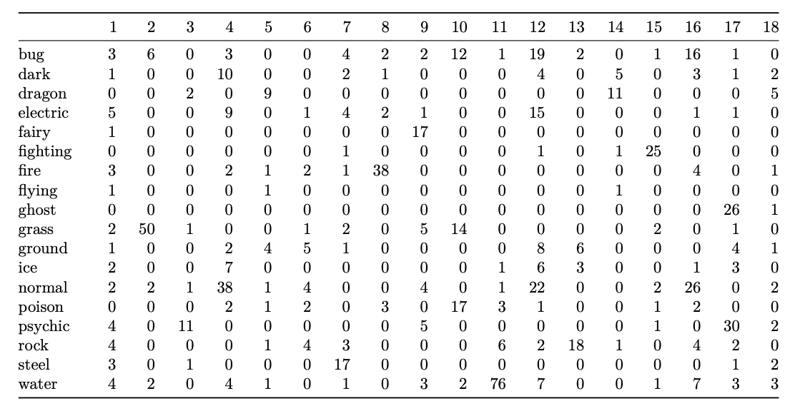
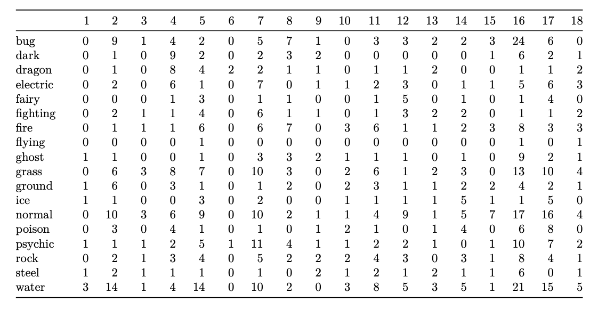

```{r setup, include=FALSE, message=FALSE}
knitr::opts_chunk$set(echo = FALSE, warning = FALSE, message = FALSE)
 #output: beamer_presentation
library(patchwork)
library(knitr)
library(dplyr)
library(kableExtra)
library(ggplot2)
# Introduction + EDA
load("Figures/data_description.RData")
# Image Dimension Reduction: PCA
load("Figures/img_dim_red.RData")
# Image Dimension Reduction: UMAP
load("Figures/umap_plt.RData")
# Clustering
load("Clustering/cluster_res.RData")
```

## Introduction

**Motivation:** Nostalgia, popularity, and an interesting, numerically-structured game design.

**Pokémon Typing:** Game mechanic (i.e. pairwise interactions), but also a conceptual grouping based on traits like colour, strength, and theme.

*Can clustering and classification methods uncover or predict a Pokémon’s type based on its image and statistical features?*

## Example: Pikachu and Charizard

```{r fig.height=6, fig.width=12}
p1_mod = p1 + theme(plot.title = element_text(size = 20, hjust = 0.5))
p2_mod = p2 + theme(plot.title = element_text(size = 20, hjust = 0.5))
p1_mod + p2_mod
```

## Data Description

From generations 1-7:

1. **Image Dataset:** 809 Pokémon, 120 x 120 PNGs with RGBA
2. **Stats Dataset:** 801 Pokémon, 41 numerical features (e.g. `hp`, `attack`, `sp_defense`, etc.)

**Pre-processing:** Flattened RGB image vectors (43,200 features); matched and cleaned datasets (801 shared Pokémon).

## Stats

```{r fig.height=5, fig.width=12}
## Attack vs. Sp. Attack stat distributions
type_attack + type_sp_attack
```

## Primary Type Distribution

```{r fig.height=5, fig.width=12}
## Primary type distribution
type_dist
```

## Methods

- **Dimension reduction:** PCA
  - Images and Stats
- **Clustering:** k-means
- **Classification:** LDA, Gradient boosting
  - For comparison

## Image Dimension Reduction: PCA

```{r fig.height=5, fig.width=10}
# Optimal: fig.height=5, fig.width=10
## Cumulative VE + Biplot
cumVE_biplot_img
```

## Example: Image Compression

```{r fig.height=5, fig.width=12}
## Image compression
# abomasnow_og + abomasnow_compressed
og_mod = abomasnow_og + theme(plot.title = element_text(size = 20, hjust = 0.5))
comp_mod = abomasnow_compressed + theme(plot.title = element_text(size = 20, hjust = 0.5))
og_mod + comp_mod
```

## Image Dimension Reduction: UMAP

```{r fig.height=5, fig.width=12}
## UMAP
# umap_plt + umap_plt_col
plt_mod = umap_plt + theme(plot.title = element_text(size = 20, hjust = 0.5))
col_mod = umap_plt_col + theme(plot.title = element_text(size = 20, hjust = 0.5))
plt_mod + col_mod
```

## K-Means Clustering

```{r fig.height=5, fig.width=12}
plt_true + plt_km_stats + plot_layout(ncol = 2)
```

## Clustering Accuracies

```{r}
combined_table
```

## Cluster Assignments for Stats Data
```{r, out.width="105%"}

```

## Cluster Assignments for Image Data
```{r, out.width="105%"}

```

## Clustering Takeaways

- Stats cluster primary types better than images
  - at best clustering classified 52% of Pokemon type

- Limitations include imbalanced data among Pokemon types, which can be accounted for in Supervised Models

- Structure of the data may not capture the complexity of the Pokemon types in a way that creates efficient and distinct clusters

## Supervised Model

## Results
